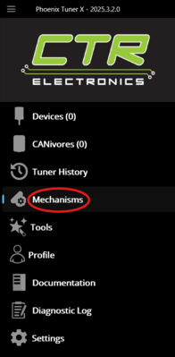

# Development Plan

1. Update the firmware of all robot hardware devices.
    * For CTRE devices, use [Phoenix Tuner X](https://apps.microsoft.com/detail/9nvv4pwdw27z?hl=en-US&gl=US).
    * For REV Robotics devices, use [REV Hardware Client](https://docs.revrobotics.com/rev-hardware-client).
2. Ensure all CAN devices have a unique ID.
3. Use **Phoenix Tuner X** to generate the initial codebase. Go to the **Mechanisms** tab and follow the instructions. The generated code will include a swerve drive subsystem.

4. Create hardware device objects in the `RobotContainer` constructor, matching them with the correct CAN IDs.
5. Create subsystem classes. Instance them in the `RobotContainer` constructor, passing to them the necessary hardware device objects.
6. Create commands for the subsystems, ideally within the subsystem classes themselves.
7. Map controller inputs to commands to run.
